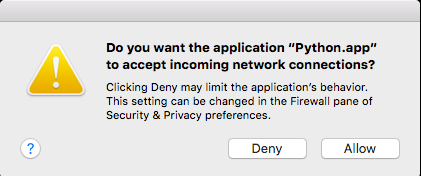
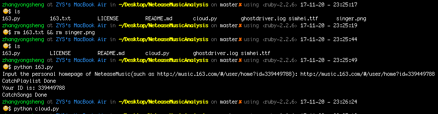

# NeteaseMusicAnalysis
网易云音乐个人数据分析，，，初步(未完成)～～～  
从“我喜欢的音乐”中提取统计歌手，生成词云

## 依赖环境
python 2.7
### python库
浏览器模仿：selenium  
存储相关：os  
图像处理：matplotlib, wordcloud   
其它：time, traceback

## 下载安装

### 1.安装wordcloud模块及selenium模块
在终端输入如下命令：
```bash
$ pip install wordcloud

$ pip install selenium
```

### 2.下载到本地
在终端输入如下命令：
```bash
$ git clone git@github.com:ZYSzys/NeteaseMusicAnalysis.git
```
或点击右上角绿色按钮Download ZIP


## 使用方法

在文件存储目录下 终端输入：
```
$ cd NeteaseMusicAnalysis #进入当前目录
$ rm 163.txt && rm singer.png #删除原有数据及图片
$ python 163.py #按提示输入网页版网易云音乐的个人主页(若出现对话框点击"Allow")
```




```
$ python cloud.py #从163.txt中读取数据生成词云
```

